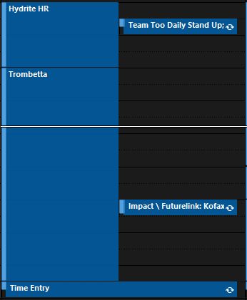
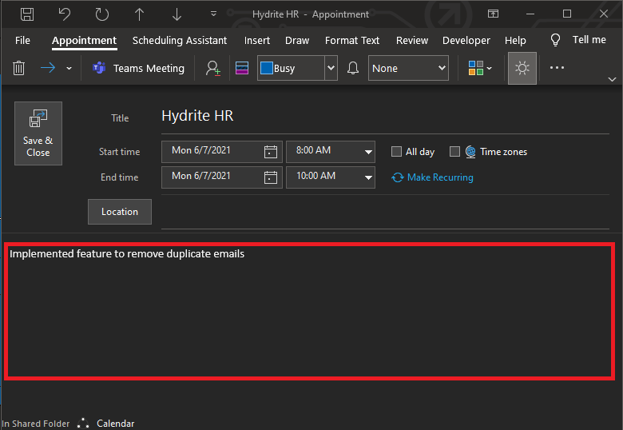

# Timebot [](https://www.python.org/)

Easily automate your time entry through base99 and smartsheet

## Dependencies

* [Python3](https://www.python.org/downloads/)
* [pywin32](https://pypi.org/project/pywin32/)
* [Selenium](https://selenium-python.readthedocs.io/installation.html#installing-python-bindings-for-selenium)

After installing Python3:

````sh
pip install pywin32 selenium
````

## Usage

In outlook, create a calendar entry for each activity you worked on for the day:




*Optional:* add a description for what you worked on:




Create a CONFIG.py file following this format, and place into the [src](src) directory:

````python
username  = ""        # enter your username
password  = ""        # enter your password (OPTIONAL, if you don't enter here, you will be prompted every time you run)
dashboard = ""        # paste the link to your smartsheet dashboard
threshold = 3         # minimum threshold for matching your calendar entry to your dashboard project name
````

After this, you can just run the [Timebot](Timebot.py) file in the [root](.) directory

```sh
python Timebot.py
```
